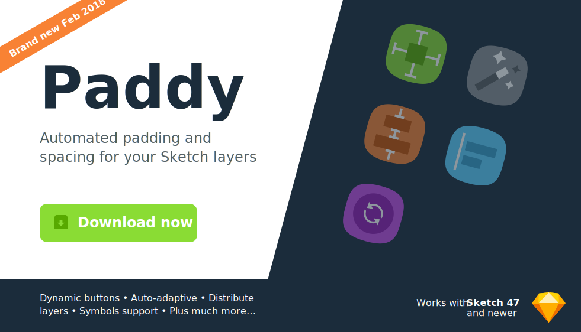
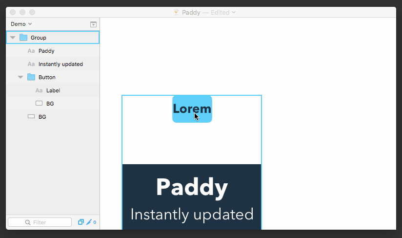
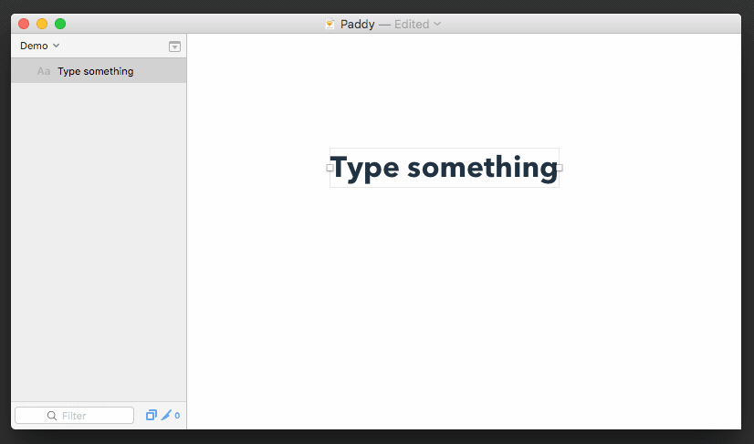
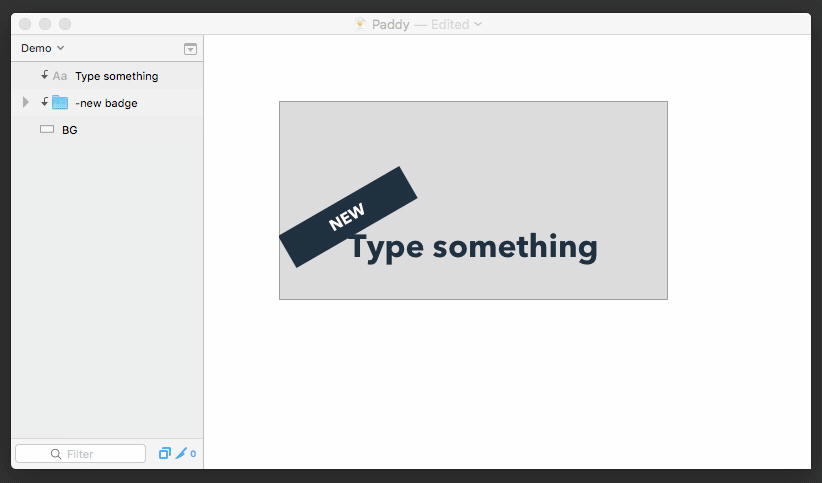
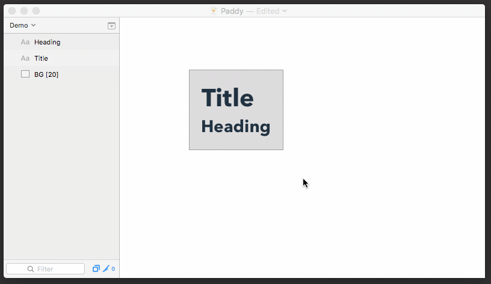
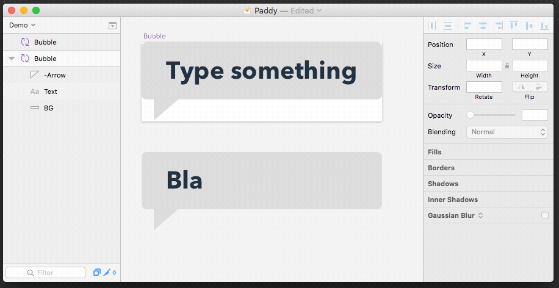
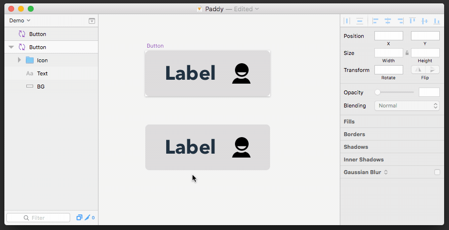
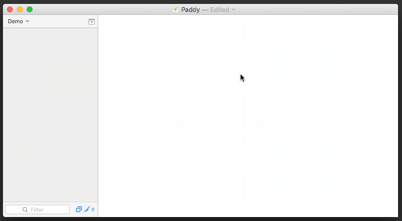
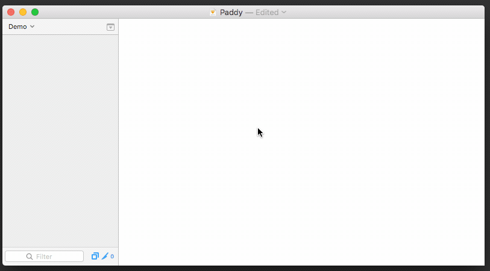
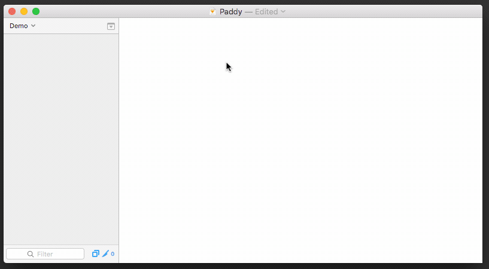

---

Double click the downloaded file (*Paddy.sketchplugin*) to install it.

---

**If you are using this plugin, please 'star' this project**. It's a simple way for me to be able to see how many people are using this, and how much effort I need to put into improving it further.

If you ***love*** this plugin, why not shout me a coffee ☕️ via [PayPal](https://www.paypal.me/dtw/5) to share the love!
It will definitely help me to be able to support this plugin further.

Follow [@davidwilliames](https://twitter.com/davidwilliames) on Twitter 

---

### [📖 View change log / release notes](https://github.com/DWilliames/paddy-sketch-plugin/releases)

---

## Why this plugin?

There are some similar plugins out there that do some of the features of this plugin, but none of them do all of it in the simple way I wanted them to.

* **Automatic:** Most other plugins require a keyboard shortcut for them to be applied, or re-applied. This is all done automatically as you manipulate your layers; simply deselect everything, and will be updated.
* **Visible properties:** It's easy to scan your layer list to see what padding / spacing is applied to your layers and groups; without the need to select them individually. This is because all the properties are set via the layer's name.
* **No special data manipulation:** This simply resizes and moves your layers to optimal positions – it doesn't turn your groups into a special 'Stack group' or something; so other people or programs such as Zeplin, can read the Sketch file perfectly fine, without the need for this plugin too.
* **Lightweight:** It just does a couple of core things – it's not bloated with a bunch of unused features.

---

Padding can be applied to one 'Background' layer (either a shape layer or a Symbol) of a group. The 'Background' layer will automatically resize itself so that it surrounds all other layers within that group by a specified amount.

Specify the padding amount within the background layer's name between '**[**' and '**]**'. e.g. **`Background [10 20]`**. The format of the padding values should be in the same order as [CSS](https://www.w3schools.com/cssref/pr_padding.asp).

Examples:
* **`[20]`**
  * all sides have a padding of `20`
* **`[10 5]`**
  * top and bottom padding are `10`
  * left and right padding are `5`
* **`[10 5 15]`**
  * top padding is `10`
  * right and left padding are `5`
  * bottom padding is `15`
* **`[10 5 15 20]`**
  * top padding is `10`
  * right padding is `5`
  * bottom padding is `15`
  * left padding is `20`

Run the plugin command **'Enter padding for selection'** or **`Control + Alt + p`** to bring up an input field, to save padding to all your selected layers easier.

If you don't want to be prompted to enter the specified padding, and instead want it to be automatically inferred from what it already is – run the command **'Imply padding for selection'** or **`Command + shift + p`**.

### Ignoring specific layers

To ignore specific layers when the Background layer is calculating it's size based on the padding. Simply prefix the name of the layer you want to ignore with a '-'. e.g. **`-new badge`** would be ignored.

### Ignoring padding for specific edges

If you don't want to apply padding to the top, bottom, left or right; simply use an **'x'** instead of a number.

E.g to set padding of 60 to the top and bottom, but ignore applying any padding on the left and right, the background layer's name would include **`[60 x]`**

### More advanced sizing expressions

You can also specific maximum and minimum sizes alongside padding values, separated by a semi colon – **';'**. e.g. **`[20 10; width <= 50]`** would apply a max width of '50'.

* For width use: `width` or `w`
* For height use: `height` or `h`
* Available operators: `>=`, `>`, `<`, `<=`, `=`

**Example:** **`[20;h>=250]`** would apply padding of '20' in all directions, with a minimum height of '250'.

---

In order to resize the background layer to the specified padding, simply deselect all layers – or press **`esc`** on your keyboard to deselect layers automatically.

This will automatically update all paddings and spacing for the previously selected layers.

---

A lot of time and effort has gone into making sure Paddy works with symbols as well. If a symbol contains a background layer with padding; the symbol instance will automatically resize so that the background layer has enough padding around its sibling layers.

This works great for creating dynamically resizing buttons.

This should work with Sketch Libraries too! (At least it seems to in my limited testing – fingers-crossed 🤞)

This does not manipulate elements within a symbol, it simply resizes the symbol to the best size to fit. Because of this, each symbol cannot contain more than one 'Background layer' with padding.

For best results, avoid applying padding in deeply nested groups within the symbol.

---

Similar to Anima's Stacked layers or the Distributer plugin, you can also apply 'spacing' to any group, for it to automatically distribute all its children.

To set the spacing / distribution of the layers in a group, add the spacing properties within a **`[`** and **`]`**; similar to applying padding to a group.

**Properties:** [*{Spacing}{direction}*]
* **Spacing:** the amount of spacing e.g. '10', '4'
* **Direction:**
  * 'h' for horizontal
  * 'v' for vertical

#### Spacing / distribution examples
* **`[10v]`** – spacing the elements vertically, with a spacing of 10
* **`[5h]`** – spacing the elements horizontally, with a spacing of 5

Run the plugin command **'Apply spacing to selection'** or **`Control + Alt + Command + p`** to bring up an input field, to save spacing to all your selected groups easier.

### Spacing in symbols

Let's talk about spacing in symbols. You can layout your elements with 'spacing' within your Master symbol artboard, if that makes things easier... however, it will not maintain the spacing after overriding the symbol. This is simply not possible without doing some weird data manipulation, which would break viewing it in other programs such as Zeplin.

If however, you do not care about being compatible with programs such as Zeplin; you can you [Anima's AutoLayout plugin](https://animaapp.github.io) with 'Stack groups'. Paddy will take Stack groups into account when resizing a symbol; even with its overrides. Which in most cases, is probably what you want to do when applying spacing within your Symbol.

---

You can also set the alignment for all the layers within a group — all of which will be automatically applied. 'Alignment' can be applied on a group by itself, or in conjunction with 'spacing'.

Similar to spacing / padding, it is by naming the group something specific, within **`[`** and **`]`**.

**Properties:** [*{alignment}*] or [*{Spacing}{direction} {alignment}*]

**Alignment**
* 'l' / 'left' – align to the left
* 'c' / 'center' – align in the center, horizontally
* 'r' / 'right' – align to the right
* 't' / 'top' – align on the top
* 'm' / 'middle' – align in the middler, vertically
* 'b' / 'bottom' – align on the bottom

**Examples**
* **`[left]`** – align all layers left
* **`[10v c]`** – space all layers vertically with a spacing of 10, all centered horizontally
* **`[5h b]`** – space all layers horizontally with a spacing of 5, all aligned at the bottom

You can even specify more than one alignment value, if you wish. For example: **`[c m]`** will align the layers in the middle and center. Or **`[t c]`** to align on the top + center.

---

## Contribute and report bugs

This plugin is in active development.

Pull requests are welcome and please submit bugs 🐛.

## Contact

* Email <david@williames.com>
* Follow [@davidwilliames](https://twitter.com/davidwilliames) on Twitter

---

Check out my other Sketch Plugins:
* [📕 PDF Export](https://github.com/DWilliames/PDF-export-sketch-plugin)
* [Google Sheets content sync](https://github.com/DWilliames/Google-sheets-content-sync-sketch-plugin)
* [Nudge Resize](https://github.com/DWilliames/nudge-resize-sketch-plugin)
* [Nudge Corner Radius](https://github.com/DWilliames/nudge-corner-radius-sketch-plugin)
